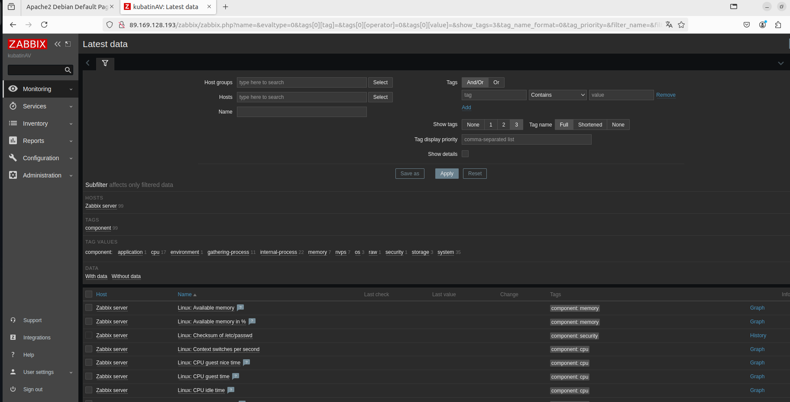
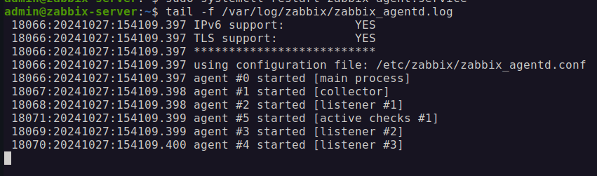
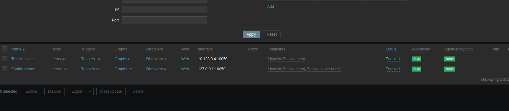
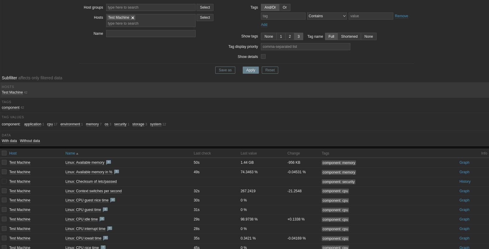
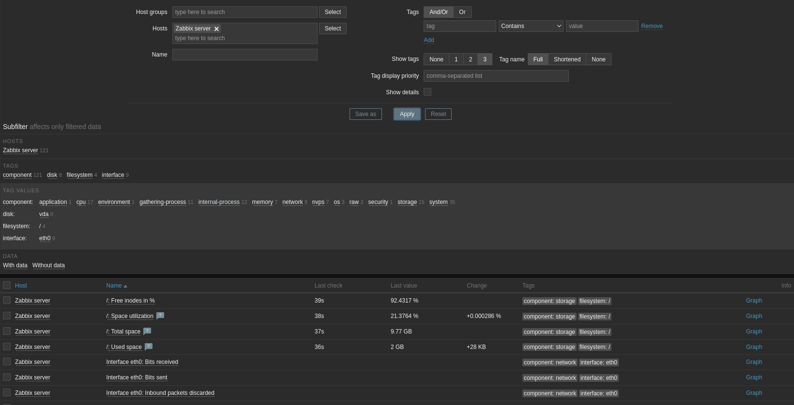
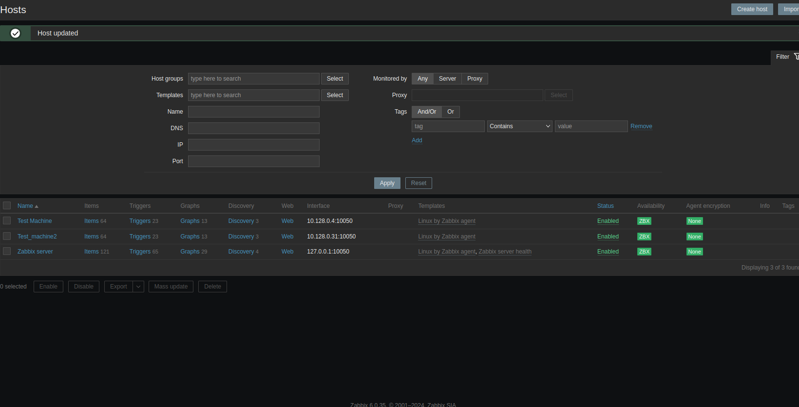
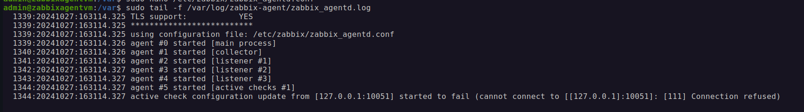
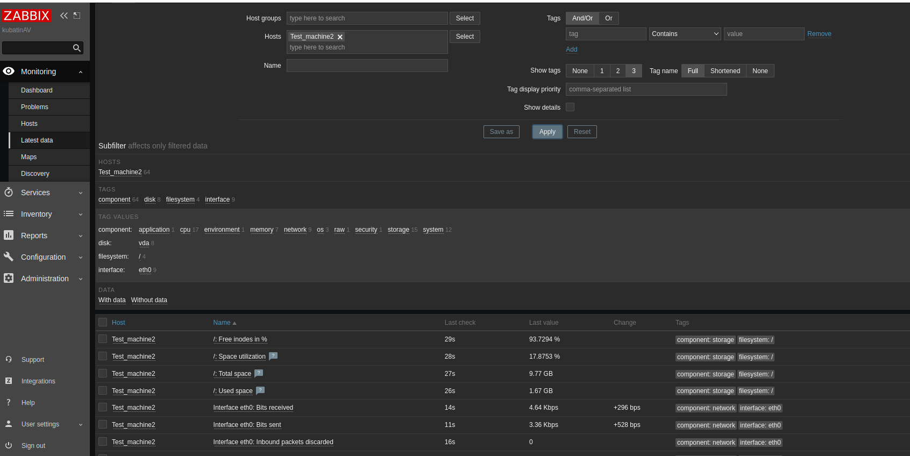

## Домашнее задание к занятию «Система мониторинга Zabbix»

### Задание 1 

Установите Zabbix Server с веб-интерфейсом.

#### Процесс выполнения
1. Выполняя ДЗ, сверяйтесь с процессом отражённым в записи лекции.
2. Установите PostgreSQL. Для установки достаточна та версия, что есть в системном репозитороии Debian 11.
3. Пользуясь конфигуратором команд с официального сайта, составьте набор команд для установки последней версии Zabbix с поддержкой PostgreSQL и Apache.
4. Выполните все необходимые команды для установки Zabbix Server и Zabbix Web Server.

#### Требования к результаты 
1. Прикрепите в файл README.md скриншот авторизации в админке.
2. Приложите в файл README.md текст использованных команд в GitHub.

### Решение:
#### Для установки заббикса 6.0 из видео-обучения
1. sudo apt update
2. sudo apt install postgresql
3. Идем на сайт заббикса и выбираем нужные параметры https://www.zabbix.com/ru/download?zabbix=6.0&os_distribution=debian&os_version=11&components=server_frontend_agent&db=pgsql&ws=apache
4. wget https://repo.zabbix.com/zabbix/6.0/debian/pool/main/z/zabbix-release/zabbix-release_latest+debian11_all.deb
5. Устанавливаем скачанный пакет командой dpkg -i zabbix-release_latest+debian11_all.deb
6. Добавляем ссылки на репозиторий командой cat /etc/apt/sources.list.d/zabbix.list
7. sudo apt update
8. Устанавливаем веб интерфейс, заббикс сервер - sudo apt install zabbix-server-pgsql zabbix-frontend-php php7.4-pgsql zabbix-apache-conf zabbix-sql-scripts
9. Создание пользователя БД sudo -u postgres createuser --pwprompt zabbix
10. Создание БД sudo -u postgres createdb -O zabbix zabbix
11. Импортируем начальную схему zcat /usr/share/zabbix-sql-scripts/postgresql/server.sql.gz | sudo -u zabbix psql zabbix
12. Настраиваем пароль DBPassword sudo nano /etc/zabbix/zabbix_server.conf
13. Перезапускаем sudo systemctl restart zabbix-server apache2
14. Включаем автозапуск sudo systemctl enable zabbix-server apache2
#### Установка веб интерфейса
1. Переходим на ip сервера с /Zabbix http://89.169.128.193/zabbix/
2. Указываем заббикс сервер имя, например имя и инициалы, указываем часовой пояс, выбираем тему
3. доходим до финиша, далее авторизуемся, логин Admin пароль zabbix

---

### Задание 2 

Установите Zabbix Agent на два хоста.

#### Процесс выполнения
1. Выполняя ДЗ, сверяйтесь с процессом отражённым в записи лекции.
2. Установите Zabbix Agent на 2 вирт.машины, одной из них может быть ваш Zabbix Server.
3. Добавьте Zabbix Server в список разрешенных серверов ваших Zabbix Agentов.
4. Добавьте Zabbix Agentов в раздел Configuration > Hosts вашего Zabbix Servera.
5. Проверьте, что в разделе Latest Data начали появляться данные с добавленных агентов.

#### Требования к результаты 
1. Приложите в файл README.md скриншот раздела Configuration > Hosts, где видно, что агенты подключены к серверу
2. Приложите в файл README.md скриншот лога zabbix agent, где видно, что он работает с сервером
3. Приложите в файл README.md скриншот раздела Monitoring > Latest data для обоих хостов, где видны поступающие от агентов данные.
4. Приложите в файл README.md текст использованных команд в GitHub

## Решение:
#### Для установки zabbix-agent заббикса 6.0 из видео-обучения
1. Так как deb пакует уже был скачан, то мы сразу распакуем его, если устанавливаем агент, где еще не был установлен заббикс, то необходимо скачать пакет по ссылке: wget https://repo.zabbix.com/zabbix/6.0/debian/pool/main/z/zabbix-release/zabbix-release_latest+debian11_all.deb
2. Распаковать его sudo dpkg -i zabbix-release_latest+debian11_all.deb
3. обновить апт кэш sudo apt update
4. установить zabbix-agent - sudo apt install zabbix-agent
5. В разделе Hosts добавить новый хост, указать имя, ip адресс хоста, добавить группу, например Linux servers, добавить темплейт Linux by Zabbix agent и создать новый хост
6. find / -name zabbix_agentd.conf указываем имя конфиг файла и находим расположение
7. редактируем файл nano /etc/zabbix/zabbix_agentd.conf
8. ctrl + w, server=  Так находим адреса, с которых разрешено получать подключение от заббикс серверов, по умолчанию указано 127.0.0.1 (разрешает подключение заббикс сервера который установлен с ним на одном хосте)
9. Добавляем ip адрес нашего заббикс сервера 10.128.0.4
10. Перезапускаем заббикс агент, чтобы изменения вступили в силу sudo systemctl restart zabbix-agent.service
11. Обязательно смотрим лог что заббикс агент запустился (Если нет, то ошибка в конфиге) - sudo systemctl status zabbix-agent.service
12. Посмотреть лог заббикс агента tail -f /var/log/zabbix/zabbix_agentd.log

